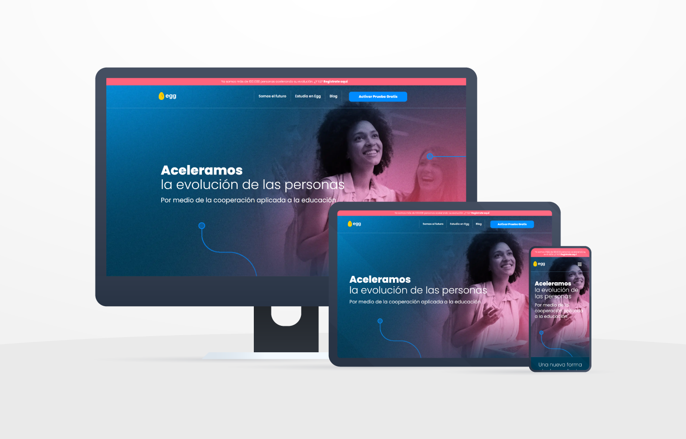
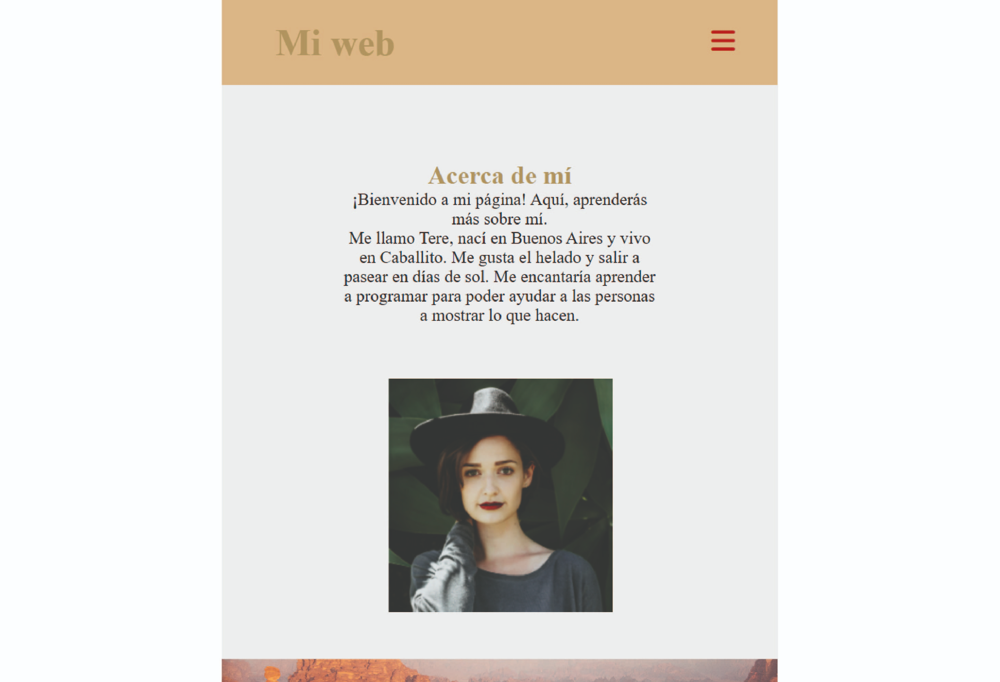
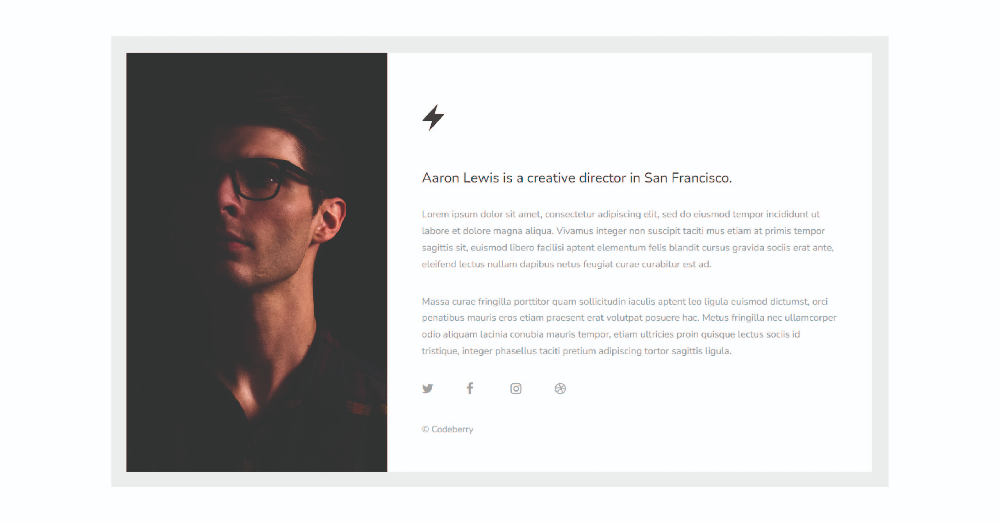
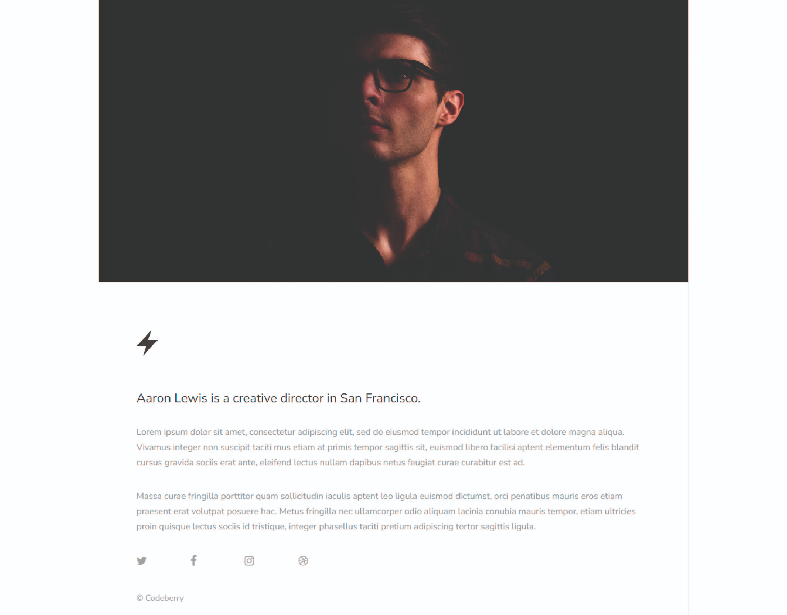
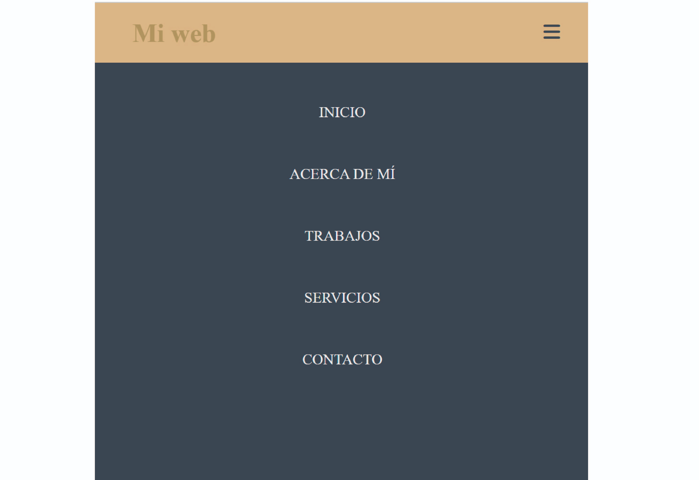

# clase_07
# 🏠 Paso 19 - ¡Adaptando nuestro diseño!


## 👋 ¡Bienvenido a tu siguiente paso! 
¡Hola! Seguimos avanzando 👟

En los pasos previos vimos como crear nuestro primer sitio web y darle estilos con CSS. En estos próximos pasos veremos cómo hacer que el diseño se adapte a distintos tamaños y navegadores. A esto lo llamamos diseño responsive.


¿Listo? ¡Vamos! 🚀

## 📖 Material descargable
Aquí es donde encontrarás el material descargable que complementará los ejercicios prácticos que vamos a ver en los siguientes pasos. 

Para tu primer encuentro en vivo tienes que leer solo el material que te compartimos a continuación 👉 Diseño responsive


## 📢 ¡Importante!

* No debes memorizar, concéntrate en entender el concepto. La práctica hará que luego puedas aplicarlo con más agilidad.

* Si hay algo que no comprendes, ¡no te preocupes! Anótalo y pregunta a tus compañeros en el encuentro en vivo. 

## ✍️ Para tu próximo encuentro en vivo
En esta ocasión les vamos a pedir que puedan ver el siguiente video sobre media queries

https://youtu.be/TBipiJFQeLk

✅ Checklist
Asegúrate de:

Leer el material teórico

Ver el video sobre media queries

💡 Revisar estos puntos es muy importante dado que ayudarán a que todos puedan tener la mejor experiencia posible y logren resolver los desafíos correspondientes. 

Si queres colaborar o sugerir algun cambio en este paso, hacelo 👉 aquí.

# 👣 Paso 20 - ¡A trabajar en equipo!


## 👋 ¡Bienvenido a tu siguiente paso! 
Llegó el momento de adaptar el diseño a los distintos dispositivos. 

🛑✋ Momento, antes de continuar, validen: ¿todos vieron el video sobre media queries? Si no es así, tómense el tiempo de realizar este paso y sacarse las dudas porque ¡lo vamos a necesitar!. Si encuentran alguna dificultad, recuerden que pueden llamar al mentor para sacarse las dudas. 

¡Continuemos! 🚀

💡 Para este paso, les vamos a pedir que:

🔸Resuelvan individualmente el ejercicio en su propia computadora.

🔸Preguntar a tus compañeros en caso de no entender alguna parte. 

🔸Si no logran resolver algo entre todos, no olviden llamar al mentor para que los ayude. 

📌 ¡Recuerden mantener las cámaras encendidas en todo el proceso! ¡Sé protagonista de tus objetivos!

## ✏️ Actividad - Adaptando el diseño de nuestro sitio
Para adaptar el diseño a celulares necesitamos establecer cuál va a ser el tamaño a partir del cual el contenido se va a modificar.  En este caso vamos a usar 768px como límite, es decir que si el ancho máximo es menor o igual a 768, nuestro diseño se va a adaptar diferente. 

Lo escribimos de la siguiente manera:
```
/* Estilos para pantallas más pequeñas (hasta 768px) */
@media (max-width: 768px) {
  /* Aquí puedes escribir los estilos que se aplicarán en pantallas más pequeñas */
}
```
1. Hacer una prueba de cambio de color de fondo del encabezado al achicar el navegador. Es decir, se debe aplicar una media-query que cambie el color del fondo del encabezado cuando se achica la pantalla. 

Mira el siguiente video para ver cómo funciona. 

https://youtu.be/MNJY-8OPLX8

2. Adapta el contenido del texto y la imagen de “Acerca de mí” para que se adapte al celu. 

Debería verse de la siguiente manera:



## ✨ Ejercicio complementario 
Para continuar practicando.  Te dejamos como desafío replicar el siguiente diseño https://codeberry.net/demo/orion/. Revisa cómo se adapta a los diferentes dispositivos y trata de replicar ese diseño.
 


✅ Checklist
Asegúrate de:

Adaptar tu web para celulares

💡 Revisar estos puntos es muy importante dado que ayudarán a que todos puedan tener la mejor experiencia posible y logren resolver los desafíos correspondientes. 

Si queres colaborar o sugerir algun cambio en este paso, hacelo 👉 aquí.

# 👣 Paso 21 - ¡Barra de navegación!

## 👋 ¡Bienvenido a tu siguiente paso! 
🛑✋ Momento, antes de continuar, validen: ¿todos pudieron adaptar su sitio a celulares? Si no es así, tómense el tiempo de realizar este paso y sacarse las dudas porque ¡lo vamos a necesitar!. Si encuentran alguna dificultad, recuerden que pueden llamar al mentor para sacarse las dudas. 


¡Continuemos! 🚀

💡 Para este paso, les vamos a pedir que:

🔸Resuelvan individualmente el ejercicio en su propia computadora.

🔸Preguntar a tus compañeros en caso de no entender alguna parte. 

🔸Si no logran resolver algo entre todos, no olviden llamar al mentor para que los ayude. 

📌 ¡Recuerden mantener las cámaras encendidas en todo el proceso! ¡Sé protagonista de tus objetivos!

## ✏️ Actividad - Barra de navegación responsive

Para crear una barra de navegación responsive vamos a necesitar incorporar un ícono. Para ello utilizaremos una página que se llama Fontawesome
https://fontawesome.com/

1. Coloca la siguiente línea de código en el head de tu sitio.
```
<script src="https://kit.fontawesome.com/c9b87a4bee.js" crossorigin="anonymous"></script>
```

2. Agrega el siguiente código dentro de la etiqueta nav
```
<input type="checkbox" id="check" />
        <label for="check" class="checkbtn">
          <i class="fa-solid fa-bars"></i>
        </label>
```
Mira el siguiente video y sigue los pasos para crear tu menú responsivo.
https://youtu.be/dzD1em8xO6s

📌Hasta aquí lo logramos con css pero próximamente veremos cómo hacer que funcione con Javascript! 🎉

🖥️ Cuando todos hayan logrado seguir las instrucciones, de a uno vayan compartiendo pantalla mostrando su código y el resultado de su CSS.

➕ Referencia de cómo debería verse la estructura del sitio.



✅ Checklist
Asegúrate de:

Adaptar el sitio a dispositivos web

Agregar la barra de na

💡 Revisar estos puntos es muy importante dado que ayudarán a que todos puedan tener la mejor experiencia posible y logren resolver los desafíos correspondientes.

## 🔎 Resumen y buenas prácticas aprendidas
Revisar que nuestro sitio se adapte a varias medidas

Las media queries sirven para adaptar los sitios a los diferentes tamaños de pantalla

## 📓 Test
Por último, te proponemos realizar un muy breve test para poner a prueba los aprendizajes alcanzados. Vamos 🚀

📝 Realizar test
https://eggeducacion.typeform.com/to/VkbOcIuI#form_type=autoevaluacion&profile_id=65124ef5f615c80f596b9c98&step_id=6IVA2hwkYqjor5cTzKqSpN&module_id=1aVJePrGRBrkp5WrfPIzbW&section_id=1hvt8hKI1bCap5RpQjVZOl

⏭️ En el próximo encuentro comenzaremos a ver Javascript, para agregar dinamismo al sitio. Si queres colaborar o sugerir algun cambio en este paso, hacelo 👉 aquí.


